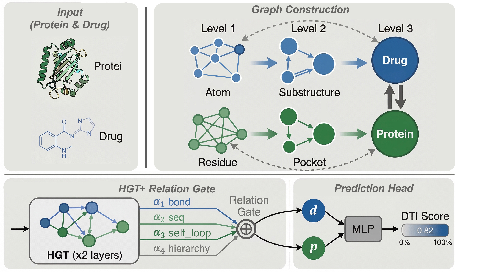

# HierHGT-DTI

Official code and benchmark resources for HierHGT-DTI, a hierarchical heterogeneous graph transformer framework for cold-start drug-target interaction prediction.

## Model overview



## Included

- `model/`: main training and ablation scripts used in the manuscript
- `data/`: processed DrugBank and BioSnap benchmark splits plus cache builders
- `baselines/`: retained baseline adaptation code for the manuscript baselines (`MolTrans`, `TransformerCPI`, `DrugBAN`, `DO-GMA`, `GeNNius`)
- `assets/`: manuscript-facing figures

## Excluded from this repository snapshot

- generated drug and protein caches under `data/drug_cache/` and `data/esm_cache*/`
- training outputs under `model/output*`
- unused baseline candidates and supplementary helper files not required for the paper

## Quick start

```bash
conda env create -f environment.yml
conda activate hierhgt-dti

python data/cache_drug_graphs.py
python data/cache_esm_features.py
```

## Run examples

Single training run:

```bash
python model/train_hierhgt_dti.py --config model/config_hierhgt_dti.yaml --mode single
```

Run all built-in dataset settings:

```bash
python model/train_hierhgt_dti.py --config model/config_hierhgt_dti.yaml --mode all
```

Run ablations:

```bash
python model/run_hierhgt_dti_ablation.py --dataset biosnap drugbank --split random cold_drug cold_protein --seeds 42
```

Run the retained manuscript baselines:

```bash
bash baselines/run_selected_baselines.sh
```

## Repository layout

- `model/config_hierhgt_dti.yaml`: default experiment config
- `model/train_hierhgt_dti.py`: main training entry
- `model/run_hierhgt_dti_ablation.py`: manuscript ablation runner
- `data/cache_drug_graphs.py`: RDKit-based drug cache builder
- `data/cache_esm_features.py`: ESM-based protein cache builder
- `baselines/run_selected_baselines.sh`: baseline runner for the retained comparison models
